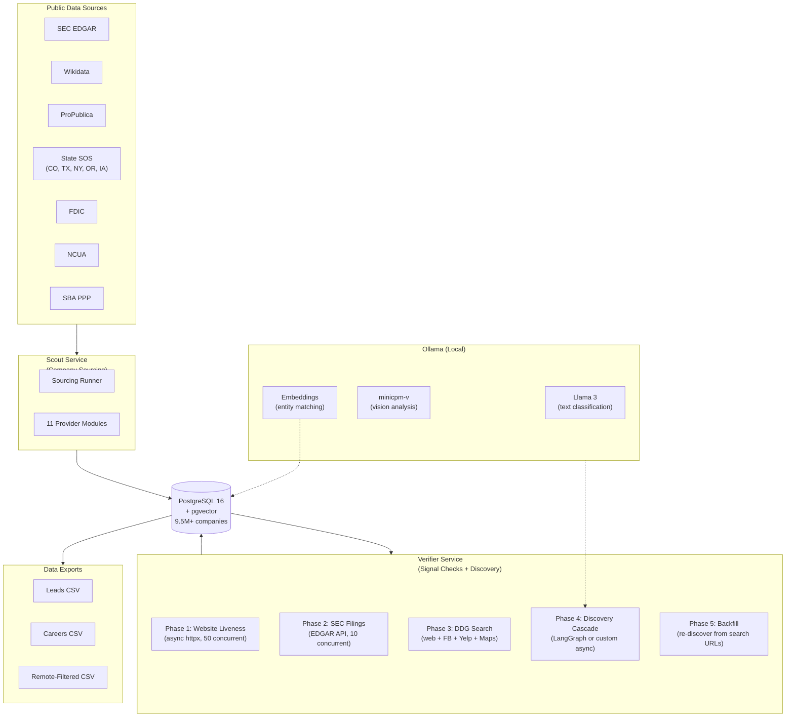
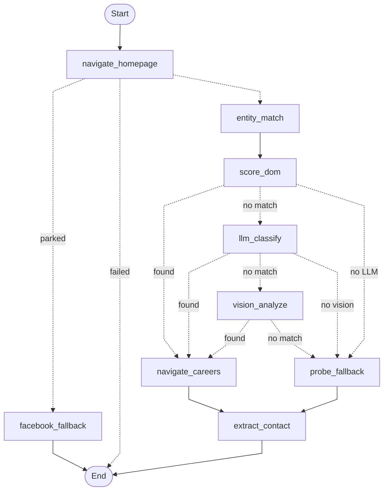

# Architecture

Blueprint is an agentic company intelligence platform built as a set of decoupled Python services sharing a PostgreSQL database. The two operational services — **Scout** (sourcing) and **Verifier** (signal checks + discovery) — run as batch pipelines via `just` recipes. Three additional services (Evaluator, Applier, Dashboard) are scaffolded for the next phase.

## System Architecture



## Project Structure

```
blueprint/
├── docker-compose.yml              # PostgreSQL (pgvector), Ollama, pgAdmin
├── justfile                         # Dev task runner
├── pyproject.toml                   # uv workspace root
├── db/
│   └── init/
│       ├── 001_schema.sql           # Jobs table, status enum
│       ├── 003_companies.sql        # Companies table
│       ├── 009_company_signals.sql  # Signal tracking (JSONB)
│       └── 011_pgvector_embeddings.sql  # Vector embeddings table
├── services/
│   ├── common/                      # Shared DB layer (psycopg, connection pool)
│   ├── scout/                       # Company sourcing (11 providers)
│   ├── verifier/                    # Verification + LangGraph discovery
│   ├── evaluator/                   # Job scoring (planned)
│   ├── applier/                     # Application automation (planned)
│   └── dashboard/                   # Review UI (planned)
└── docs/adr/                        # 10 Architecture Decision Records
```

## Scout: Company Sourcing Pipeline

The Scout service fetches company data from 11 public providers and batch-upserts into PostgreSQL with deduplication on normalized name + source + source_id.

### Providers

| Provider | Data Extracted | Scale |
|----------|---------------|-------|
| SEC EDGAR | Tickers, SIC codes, employee counts, total assets, filer category | ~10K public companies |
| Wikidata | Names, descriptions, founding dates, industries | ~50K entities |
| ProPublica | Nonprofit organizations | ~1.8M nonprofits |
| Colorado SOS | State business registrations | ~2M entities |
| Texas SOS | State business registrations | ~3M entities |
| New York SOS | State business registrations | ~1M entities |
| Oregon SOS | State business registrations | ~800K entities |
| Iowa SOS | State business registrations | ~400K entities |
| FDIC | FDIC-insured banks | ~5K banks |
| NCUA | Credit unions | ~5K credit unions |
| SBA PPP | PPP loan recipients (employee counts, NAICS) | ~1M businesses |

### Companies Table

| Column | Type | Source |
|--------|------|--------|
| name / normalized_name | TEXT | All providers |
| employee_count | INTEGER | SEC, SBA PPP |
| industry / sic_code / naics_code | TEXT | SEC, Wikidata |
| city / state | TEXT | SOS, SEC |
| website | TEXT | SEC, Wikidata |
| ticker / exchange | TEXT | SEC |
| source / source_id | TEXT | Provider identifier |
| total_assets | BIGINT | SEC |
| filer_category | TEXT | SEC (large accelerated, accelerated, etc.) |

## Verifier: Multi-Phase Signal Pipeline

The Verifier runs 5 phases per batch with maximum parallelism. Signals are persisted incrementally after each phase so partial progress survives crashes.

### Phase Execution

```
Phase 1 (Website) ──────────────┐
Phase 2 (SEC) ──────────────────┼── all start concurrently
Phase 3 (DDG Search) ───────────┘
         │
Phase 4 (Discovery) ──���─────────── starts after Phase 1 completes
         │
Phase 5 (Backfill) ─────────────── after Phase 4 + Phase 3 complete
```

### Signal Types

All signals stored in `company_signals` table as `(company_id, check_type, result JSONB)` with upsert on conflict.

| Check Type | Method | Result Schema |
|-----------|--------|---------------|
| `website` | httpx HEAD/GET | `{website_url, website_status, website_reachable, website_redirect_url, website_title, website_is_parked}` |
| `web_search` | DuckDuckGo text search | `{search_top_url, search_top_snippet, search_result_count}` |
| `facebook` | DDG site:facebook.com | `{facebook_url}` |
| `yelp` | DDG site:yelp.com | `{yelp_url, yelp_closed}` |
| `maps` | DDG Google Maps | `{gmaps_name, gmaps_closed}` |
| `sec` | SEC EDGAR API | `{sec_filing_type, sec_last_filing_date}` |
| `careers` | Discovery cascade | `{careers_url, ats_platform, ats_url}` |
| `contact` | Page extraction | `{contact_email, contact_phone, contact_page_url}` |

### Tiered Company Prioritization

Verification batches are filled by priority tier:

1. Large companies with website (100+ employees)
2. Public/SEC companies (ticker or sec_edgar source)
3. Medium companies with website (50-99 employees)
4. Large companies without website
5. Southern Colorado (Pueblo/CO Springs corridor)
6. Rest of Colorado
7. Medium without website
8. Any company with website (<50 employees)

80% fresh (never-verified), 20% stale (oldest signals first, >30 days).

## KYB Discovery Cascade

The core discovery logic finds career pages and identifies ATS platforms via a 4-layer escalation cascade. Two implementations exist with identical behavior:

### Custom Async (`discovery.py`, 1,497 lines)

Hand-rolled if/else cascade using Playwright + raw httpx calls to Ollama.

### LangGraph StateGraph (`graph/` module)

9-node graph with conditional edges. Same logic wrapped in LangGraph nodes, LLM calls via LangChain ChatOllama.



### Layer Details

**Layer 1: Deterministic DOM Scoring** — Extracts all `<a>` and `<button>` elements from the rendered page. Scores each for "careers-ness":

| Signal | Score |
|--------|-------|
| Exact text match ("careers", "jobs", "open positions") | 0.95 |
| Phrase match ("join our team", "we're hiring") | 0.80 |
| ATS domain in href (greenhouse.io, lever.co) | 0.90 |
| ARIA label / title attribute | 0.70 |
| URL path (/careers, /jobs) | 0.50 |

Modifiers: nav/header location ×1.1, footer ×1.05, hidden ×0.3. Threshold: 0.4.

**Layer 2: LLM Text Classification** — Sends numbered candidate elements to Ollama/Llama 3. Prompt: "Which element most likely leads to the careers page?" Response validated against careers-signal regex.

**Layer 3: Vision Model** — Injects red numbered badges over candidate elements via JS, takes a screenshot, sends to Ollama vision model (minicpm-v). Same prompt pattern, same validation.

**Layer 4: Probe Fallback** — Brute-force probes `/careers`, `/jobs`, `careers.{domain}`, `jobs.{domain}`. Validates responses: rejects login pages, off-domain redirects (unless ATS), pages without careers signals.

### ATS Detection (6 Layers, 25+ Platforms)

After finding a careers page by any method:

1. Final URL domain pattern matching
2. Page href scanning
3. Content patterns ("Powered by X")
4. iframe src attributes
5. script src attributes
6. Full HTML content scan

Platforms: Greenhouse, Lever, Workday, iCIMS, Taleo, Ashby, SmartRecruiters, BambooHR, Paycom, Jobvite, ADP, UltiPro, SAP SuccessFactors, Eightfold, Phenom, Avature, Brassring, Cornerstone, Dayforce, Rippling, JazzHR, Recruitee, Personio.

## pgvector Entity Matching

The LangGraph cascade includes an `entity_match` node that embeds the company name via Ollama and queries PostgreSQL for similar already-verified companies using cosine distance.

```sql
-- company_embeddings table
CREATE TABLE company_embeddings (
    company_id   UUID NOT NULL REFERENCES companies(id),
    embedding    vector(4096),  -- Llama 3 embedding dimension
    UNIQUE (company_id)
);

-- Cosine similarity query
SELECT c.name, ce.embedding <=> $1::vector AS distance
FROM company_embeddings ce
JOIN companies c ON c.id = ce.company_id
WHERE ce.embedding <=> $1::vector < 0.3
ORDER BY distance LIMIT 3;
```

## Technology Matrix

| Layer | Language | Key Libraries | Container |
|-------|----------|--------------|-----------|
| Scout | Python 3.12 | httpx, psycopg 3, openpyxl | `python:3.12-slim` |
| Verifier | Python 3.12 | LangGraph 1.0, LangChain 1.2, Playwright, httpx, ddgs | `python:3.12-slim` |
| Common | Python 3.12 | psycopg 3, psycopg-pool | (shared library) |
| Database | — | PostgreSQL 16 + pgvector | `pgvector/pgvector:pg16` |
| LLM | — | Ollama (Llama 3, minicpm-v) | `ollama/ollama:latest` |
| Evaluator | Python 3.12 | LangChain, LangChain-Ollama | Planned |
| Applier | Python 3.12 | Playwright, Jinja2, LaTeX | Planned |
| Dashboard | Node.js 20 | Next.js 15, React 19, Tailwind CSS 4 | Planned |

## Database Schema

### Core Tables

- **companies** — 9.5M+ records with name, industry, SIC/NAICS, location, employee count, website, ticker, source
- **company_signals** — JSONB signal store, one row per (company_id, check_type), upsert on conflict
- **company_embeddings** — pgvector embeddings for entity matching
- **sourcing_runs** — Tracks each provider execution (started, completed, row counts)
- **jobs** — Job listings pipeline (scraped → scored → approved → applied)

### Key Indexes

- `companies_normalized_name_source_idx` — Deduplication during sourcing
- `company_signals (company_id, check_type)` — UNIQUE, enables upsert
- `jobs (source, source_id)` — UNIQUE, prevents duplicate ingestion
- `jobs (status)` — Pipeline state lookups

## Deployment

All services run on a single Hetzner dedicated server (Ubuntu 24.04). Docker Compose manages PostgreSQL and Ollama. Python services run via `just` recipes using a shared `uv` workspace for development. Production deployment via Coolify with signed GitHub webhooks.

## Security Model

- **Data Sovereignty** — All data stays on the private Hetzner server. No third-party cloud services process company data or PII.
- **Local LLM** — Ollama runs locally; no data sent to external AI APIs.
- **Credential Management** — Secrets in `.env`, excluded from version control.
- **Network Isolation** — Containers on internal Docker networks; only PostgreSQL exposed on localhost.

## Architecture Decision Records

10 ADRs documenting key technical choices in [`docs/adr/`](docs/adr/README.md).

## Planned: Next Phase

- **Evaluator** — LangChain + Ollama scoring of job descriptions against a Master Profile (0-100 fit score)
- **Applier** — LaTeX resume generation + Playwright form automation for Workday, Lever, etc.
- **Dashboard** — Next.js review UI for scored opportunities
