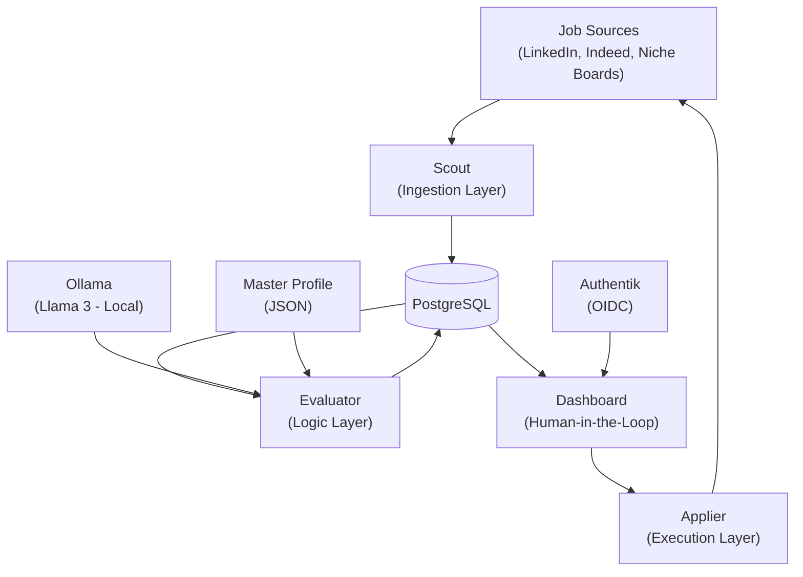
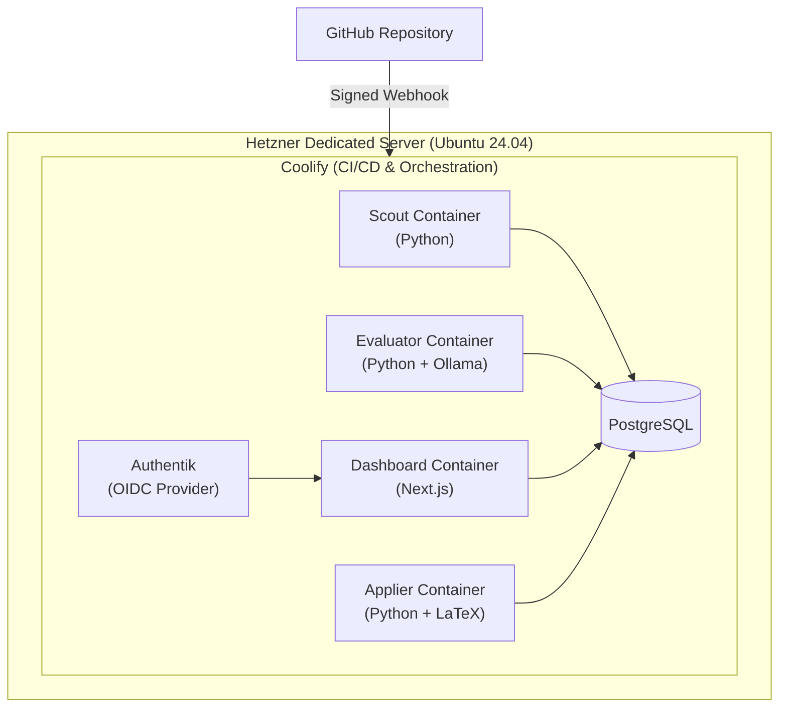

# Architecture

Blueprint is a four-layer, containerized pipeline that discovers job postings, scores them against a career profile, presents them for human review, and automates the application process. Every component runs on private infrastructure to maintain full data sovereignty.

## System Architecture Diagram



## Project Structure

```
blueprint/
├── docker-compose.yml          # Service orchestration (dev & prod)
├── .env.example                # Environment variable template
├── ARCHITECTURE.md             # This file
├── CLAUDE.md                   # Project instructions for AI tooling
├── README.md                   # Project overview and getting started
├── data/
│   └── master_profile.json     # 20-year career profile (gitignored PII)
├── db/
│   └── init/
│       └── 001_schema.sql      # PostgreSQL schema (auto-runs on first start)
├── docs/
│   └── adr/                    # Architecture Decision Records
│       ├── README.md           # ADR index
│       └── 001-*.md … 010-*.md # Individual decisions
└── services/
    ├── scout/                  # Ingestion layer (Python + Playwright)
    │   ├── Dockerfile
    │   ├── pyproject.toml
    │   └── src/scout/
    ├── evaluator/              # Logic layer (Python + LangChain)
    │   ├── Dockerfile
    │   ├── pyproject.toml
    │   └── src/evaluator/
    ├── applier/                # Execution layer (Python + LaTeX)
    │   ├── Dockerfile
    │   ├── pyproject.toml
    │   └── src/applier/
    └── dashboard/              # Human-in-the-loop (Next.js)
        ├── Dockerfile
        ├── package.json
        ├── next.config.ts
        ├── tailwind.config.ts
        └── src/app/
```

## Layers

### Scout (Ingestion)

- **Purpose:** Continuously discover and ingest job postings from multiple sources.
- **Technology:** Python + Playwright in stealth mode to avoid bot detection.
- **Input:** Job board search queries filtered to senior-level roles (Principal Architect, Data Scientist, Staff Engineer) in the Pueblo/Colorado Springs corridor and remote.
- **Output:** Raw job descriptions stored in PostgreSQL with metadata (source, URL, date, title, company).
- **Design Decision:** Playwright stealth mode was chosen over API-based scraping because most job boards either lack public APIs or heavily rate-limit them. Stealth mode mimics human browsing patterns to maintain access.

### Evaluator (Logic)

- **Purpose:** Score each job description against the Master Profile to determine fit.
- **Technology:** LangChain orchestration with Llama 3 running locally via Ollama.
- **Input:** Raw job descriptions from PostgreSQL + the Master Profile JSON.
- **Output:** A 0-100 "Fit Score" per job, written back to PostgreSQL with scoring rationale.
- **Design Decision:** A local LLM (Llama 3/Ollama) is used instead of cloud APIs to keep all career data on private infrastructure. LangChain provides the orchestration layer for structured prompt chaining and future extensibility.

### Dashboard (Human-in-the-Loop)

- **Purpose:** Present scored opportunities for human review, editing, and approval.
- **Technology:** Next.js with Tailwind CSS using a "Mountain Modern Slate & Teal" design system.
- **Input:** Scored job listings from PostgreSQL, ranked by Fit Score.
- **Output:** Approved/rejected decisions and any manual edits to application materials.
- **Design Decision:** A dedicated dashboard keeps a human in the loop before any application is submitted. The UI is designed for rapid triage — scan scores, review rationale, approve or reject in bulk.

### Applier (Execution)

- **Purpose:** Generate tailored application materials and submit them automatically.
- **Technology:** Playwright for form automation + Headless LaTeX for PDF generation.
- **Input:** Approved job listings and the Master Profile.
- **Output:** ATS-optimized PDF resumes/cover letters submitted through platforms like Workday and Lever.
- **Design Decision:** LaTeX produces consistently formatted, ATS-friendly PDFs. Playwright handles the diversity of application form implementations across different hiring platforms.

## Data Flow

1. **Discovery** — Scout queries LinkedIn, Indeed, and niche boards for matching roles.
2. **Extraction** — Playwright renders each listing and extracts the full job description.
3. **Deduplication** — Scout checks PostgreSQL for existing entries to avoid reprocessing.
4. **Storage** — New listings are written to PostgreSQL with source metadata.
5. **Retrieval** — Evaluator pulls unscored listings from the database.
6. **Profile Load** — Evaluator reads the Master Profile JSON from disk.
7. **Scoring** — LangChain sends the JD + Profile to Llama 3 via Ollama for analysis.
8. **Score Storage** — Fit Scores (0-100) and rationale are written back to PostgreSQL.
9. **Presentation** — Dashboard queries PostgreSQL for scored listings, ordered by score.
10. **Review** — User reviews, edits, and approves or rejects each opportunity.
11. **Material Generation** — Applier generates a tailored LaTeX resume/cover letter for each approved role.
12. **Submission** — Playwright navigates the target platform and submits the application.
13. **Status Update** — Application status is recorded back in PostgreSQL.

## Database Schema

The database is initialized automatically on first PostgreSQL start via `db/init/001_schema.sql`.

### Pipeline Status Enum

The `job_status` ENUM defines the state machine for the job pipeline:

```
scraped → scoring → scored → reviewing → approved → generating → applying → applied
                                       → rejected
                              (any state) → error
```

| Status | Set By | Meaning |
|--------|--------|---------|
| `scraped` | Scout | Raw listing ingested from a job board |
| `scoring` | Evaluator | LLM scoring in progress |
| `scored` | Evaluator | Fit Score assigned, awaiting review |
| `reviewing` | Dashboard | User is actively reviewing |
| `approved` | Dashboard | User approved for application |
| `rejected` | Dashboard | User rejected |
| `generating` | Applier | Resume/cover letter generation in progress |
| `applying` | Applier | Form submission in progress |
| `applied` | Applier | Application submitted successfully |
| `error` | Any | Processing failed (retryable) |

### Jobs Table

| Column | Type | Purpose |
|--------|------|---------|
| `id` | `UUID` (PK) | Auto-generated via `gen_random_uuid()` |
| `source` | `TEXT` | Platform identifier (`linkedin`, `indeed`, etc.) |
| `source_id` | `TEXT` | Platform-specific job ID |
| `url` | `TEXT` | Original listing URL |
| `title` | `TEXT` | Job title |
| `company` | `TEXT` | Company name |
| `description` | `TEXT` | Full job description |
| `location` | `TEXT` | Job location |
| `remote` | `BOOLEAN` | Remote eligibility |
| `salary_min` / `salary_max` | `INTEGER` | Salary range (when available) |
| `date_posted` | `TIMESTAMPTZ` | When the job was posted |
| `date_scraped` | `TIMESTAMPTZ` | When Scout ingested it |
| `fit_score` | `SMALLINT` (0-100) | LLM-assigned fit score |
| `score_rationale` | `TEXT` | LLM explanation of the score |
| `scored_at` | `TIMESTAMPTZ` | When scoring completed |
| `status` | `job_status` | Current pipeline state |
| `applied_at` | `TIMESTAMPTZ` | When application was submitted |
| `resume_path` | `TEXT` | Path to generated resume PDF |
| `created_at` / `updated_at` | `TIMESTAMPTZ` | Audit timestamps (auto-managed) |

### Key Indexes

- `idx_jobs_status` — Fast lookups by pipeline state (used by every service)
- `idx_jobs_fit_score` — Descending score for Dashboard ranking
- `idx_jobs_source_source_id` — Source lookups
- `idx_jobs_date_scraped` — Chronological ordering
- `idx_jobs_dedup` — **UNIQUE** on `(source, source_id)` to prevent duplicate ingestion

## The Master Profile

- **Location:** `/data/master_profile.json`
- **Purpose:** A structured JSON representation of a 20-year technical career, used as the ground truth for JD scoring.
- **Structure:**
  - `header` — Name, title, contact, location, clearance level
  - `skill_matrix` — Categorized technical skills with proficiency levels
  - `experience` — Chronological role history with responsibilities and achievements
  - `education` — Degrees, certifications, and continuing education
  - `preferences` — Target roles, salary range, location constraints, remote policy
- **Usage:** The Evaluator loads this file for every scoring run, comparing each JD field against the corresponding profile section.
- **Privacy:** This file contains PII and career history. It never leaves the Hetzner server and is excluded from version control via `.gitignore`.

## Deployment Topology

All services run on a single dedicated Hetzner server (Ubuntu 24.04). Docker Compose is used for local development; Coolify manages production container orchestration and CI/CD.



## Security Model

- **Data Sovereignty:** All data (career profile, scraped listings, credentials) stays on the private Hetzner server. No third-party cloud services process PII.
- **Authentication:** Authentik provides OIDC-based SSO for Dashboard access. No shared passwords or open endpoints.
- **Local LLM:** Ollama runs Llama 3 locally, so job descriptions and career data are never sent to external AI APIs.
- **Signed Webhooks:** GitHub-to-Coolify CI/CD triggers use signed webhooks to prevent unauthorized deployments.
- **Credential Management:** LinkedIn/Indeed credentials and API endpoints are stored in `.env`, excluded from version control.
- **Network Isolation:** Containers communicate over internal Docker networks. Only the Dashboard and Authentik expose public-facing ports behind a reverse proxy.

## Technology Matrix

| Layer | Language | Key Libraries | Container Base |
|---|---|---|---|
| Scout | Python 3.12 | Playwright ≥1.49, psycopg ≥3.2 | `python:3.12-slim` |
| Evaluator | Python 3.12 | LangChain ≥0.3, LangChain-Ollama ≥0.3, psycopg ≥3.2 | `python:3.12-slim` |
| Dashboard | Node.js 20 | Next.js 15, React 19, Tailwind CSS 4 | `node:20-alpine` (3-stage) |
| Applier | Python 3.12 | Playwright ≥1.49, Jinja2 ≥3.1, psycopg ≥3.2 | `python:3.12-slim` + TeX Live |
| Database | — | PostgreSQL 16 | `postgres:16-alpine` |
| LLM | — | Ollama (Llama 3) | `ollama/ollama:latest` |
| Identity | — | Authentik (deferred) | `ghcr.io/goauthentik/server` |

## Architecture Decision Records

This project uses [Architecture Decision Records](https://adr.github.io/madr/) to document significant technical choices. Each ADR captures the context, decision, and consequences of an architectural choice.

See the full index at [`docs/adr/README.md`](docs/adr/README.md).

## Future Considerations

- **Additional Sources** — Expand Scout to cover Glassdoor, AngelList, and company career pages directly.
- **Scoring Refinement** — Fine-tune the Llama 3 model on historical application outcomes to improve Fit Score accuracy.
- **Application Tracking** — Add post-submission status tracking (applied, viewed, interview, offer, rejected).
- **Multi-Profile Support** — Allow multiple Master Profiles for different career pivots or role types.
- **Notifications** — Push alerts (email, Slack, or mobile) when high-scoring roles are discovered.
