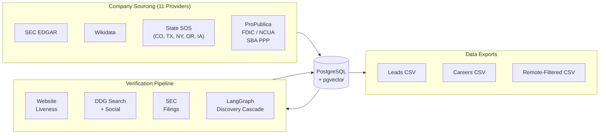
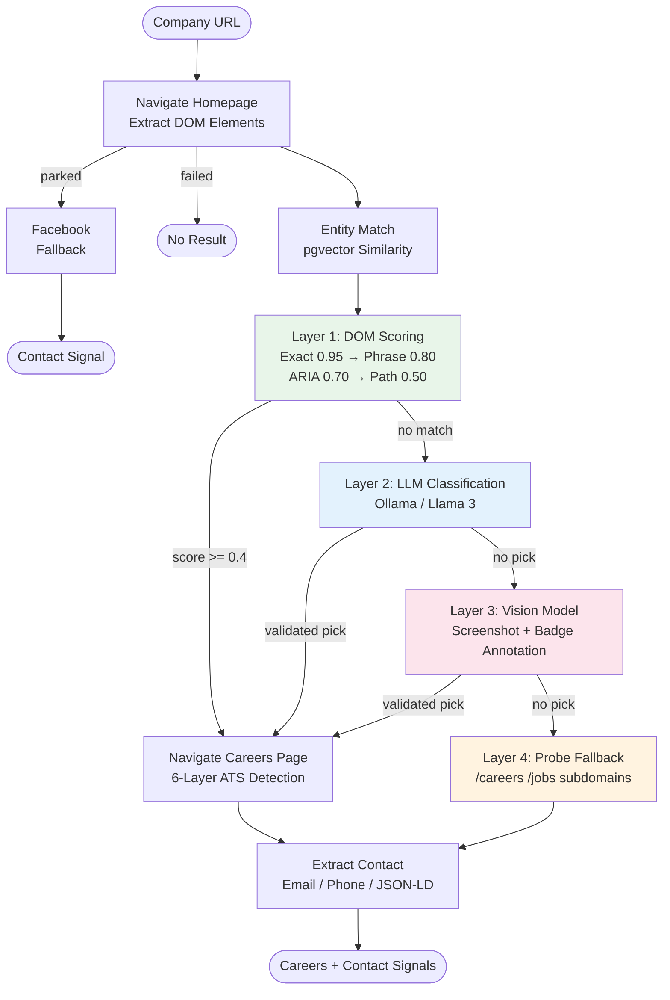

# Blueprint

**Agentic company intelligence platform** — sources 9.5M+ companies from 11 public data providers, verifies them through an 8-signal check pipeline, and discovers career pages and ATS platforms using a 4-layer AI cascade orchestrated with LangGraph.


---

## What This Demonstrates

| Skill Area | Implementation |
|-----------|---------------|
| **Agentic AI / LangGraph** | 9-node StateGraph with conditional routing and confidence-based escalation between DOM scoring, LLM classification, vision analysis, and probe fallback |
| **LangChain + Local LLM** | ChatOllama integration for both text classification and multimodal vision (screenshot annotation + element picking) |
| **Vector Search / pgvector** | Company entity matching via Ollama embeddings stored in PostgreSQL — no external vector DB |
| **Browser Automation** | Playwright stealth-mode scraping, semantic DOM element scoring, 25+ ATS platform detection |
| **Data Engineering** | 11-source ingestion pipeline with batch upsert, deduplication, and incremental persistence across 9.5M+ company records |
| **Production Patterns** | Async concurrency with semaphores, DDG circuit breakers, per-company timeout budgets, crash-resilient incremental signal persistence |

---

## Architecture



---

## KYB Discovery Cascade

The flagship feature: a 4-layer escalation cascade that discovers career pages and identifies ATS platforms for any company website. Each layer fires only if the previous one failed to find a result.



**Implemented twice** — the same cascade logic runs in both:
1. **Custom async orchestration** (`discovery.py`, 1,497 lines) — hand-rolled if/else with Playwright
2. **LangGraph StateGraph** (`graph/` module) — 9 nodes, conditional edges, typed state, LangChain Ollama

Toggle between them with `VERIFIER_USE_LANGGRAPH=true`. Same inputs, same outputs, same signal format. The comparison demonstrates understanding of both classical and framework-native approaches.

### ATS Detection (25+ Platforms)

After finding a careers page, a 6-layer detection scan identifies the ATS platform:

1. Final URL domain pattern matching
2. Page href scanning
3. Content patterns ("Powered by X")
4. iframe src attributes
5. script src attributes
6. Full HTML content scan

Detected platforms: Greenhouse, Lever, Workday, iCIMS, Taleo, Ashby, SmartRecruiters, BambooHR, Paycom, Jobvite, ADP, UltiPro, SAP SuccessFactors, Eightfold, Phenom, Avature, Brassring, Cornerstone, Dayforce, Rippling, JazzHR, Recruitee, Personio, and more.

---

## Company Sourcing Pipeline

11 public data providers, 9.5M+ company records with deduplication and batch upsert:

| Provider | Data |
|----------|------|
| **SEC EDGAR** | Public companies, tickers, SIC codes, employee counts, total assets |
| **Wikidata** | Structured company data, descriptions, founding dates |
| **ProPublica** | Nonprofit organizations |
| **Colorado SOS** | State business registrations |
| **Texas SOS** | State business registrations |
| **New York SOS** | State business registrations |
| **Oregon SOS** | State business registrations |
| **Iowa SOS** | State business registrations |
| **FDIC** | FDIC-insured banks |
| **NCUA** | Credit unions |
| **SBA PPP** | PPP loan recipients (employee counts, NAICS codes) |

---

## Verification Signal Types

Each company gets up to 8 independent signal checks, stored as JSONB in `company_signals`:

| Signal | Method | Output |
|--------|--------|--------|
| **website** | httpx HEAD/GET | `{reachable, status, title, is_parked, redirect_url}` |
| **web_search** | DuckDuckGo | `{search_top_url, search_top_snippet}` |
| **facebook** | DDG search | `{facebook_url}` |
| **yelp** | DDG search | `{yelp_url, yelp_closed}` |
| **maps** | DDG search | `{gmaps_name, gmaps_closed}` |
| **sec** | SEC EDGAR API | `{sec_filing_type, sec_last_filing_date}` |
| **careers** | LangGraph cascade | `{careers_url, ats_platform, ats_url}` |
| **contact** | Page extraction | `{contact_email, contact_phone, contact_page_url}` |

---

## Tech Stack

| Component | Technology | Version |
|-----------|-----------|---------|
| **AI Orchestration** | LangGraph + LangChain | 1.0 / 1.2 |
| **LLM** | Ollama (Llama 3, minicpm-v) | Local inference |
| **Vector Search** | pgvector (in PostgreSQL) | Cosine similarity |
| **Browser Automation** | Playwright + Stealth | >= 1.49 |
| **Database** | PostgreSQL (pgvector) | 16 |
| **Language** | Python | 3.12 |
| **Web Search** | DuckDuckGo (ddgs) | >= 7.0 |
| **HTTP** | httpx (async) | >= 0.27 |
| **Package Manager** | uv (workspace) | Latest |
| **Task Runner** | just | Justfile recipes |
| **Infrastructure** | Docker Compose / Hetzner | Ubuntu 24.04 |

---

## Project Structure

```
blueprint/
├── docker-compose.yml
├── justfile                         # Dev task runner (sourcing, verify, export)
├── db/init/                         # 11 SQL migrations (schema + pgvector)
│
├── services/common/                 # Shared DB utilities (psycopg, signals)
│
├── services/scout/                  # Company sourcing pipeline
│   └── src/scout/
│       ├── sourcing_runner.py       # Orchestrates all 11 providers
│       └── providers/               # SEC, Wikidata, SOS, FDIC, etc.
│
├── services/verifier/               # Company verification + discovery
│   └── src/verifier/
│       ├── runner.py                # Multi-phase async orchestration
│       ├── config.py                # Env-based configuration
│       ├── checks/
│       │   ├── discovery.py         # 4-layer cascade (1,497 lines)
│       │   ├── website.py           # HTTP liveness + parked detection
│       │   ├── search.py            # DDG web/Facebook/Yelp/Maps
│       │   └── sec.py               # SEC EDGAR filing checks
│       └── graph/                   # LangGraph implementation
│           ├── state.py             # DiscoveryState TypedDict
│           ├── nodes.py             # 9 graph nodes (wrapping discovery.py)
│           ├── edges.py             # Conditional routing functions
│           ├── build.py             # StateGraph assembly + batch runner
│           └── vectorstore.py       # pgvector entity matching
│
├── services/evaluator/              # Job scoring (planned — LangChain + Ollama)
├── services/applier/                # Application automation (planned — LaTeX + Playwright)
└── services/dashboard/              # Review UI (planned — Next.js)
```

---

## Quick Start

```bash
# Install dependencies
curl -LsSf https://astral.sh/uv/install.sh | sh
uv sync

# Start PostgreSQL (pgvector-enabled)
just db-up

# Run company sourcing (SEC EDGAR, Wikidata, state registries, etc.)
just sourcing

# Verify companies (website liveness, careers discovery, ATS detection)
just verify 100

# Verify with LangGraph cascade
VERIFIER_USE_LANGGRAPH=true just verify 100

# Export remote-friendly companies (filtered by industry)
just export-remote
```

---

## Architecture Decision Records

10 ADRs documenting key technical choices in [`docs/adr/`](docs/adr/README.md).

For detailed architecture documentation, see [ARCHITECTURE.md](ARCHITECTURE.md).

---

*Built in Walsenburg, CO.*
