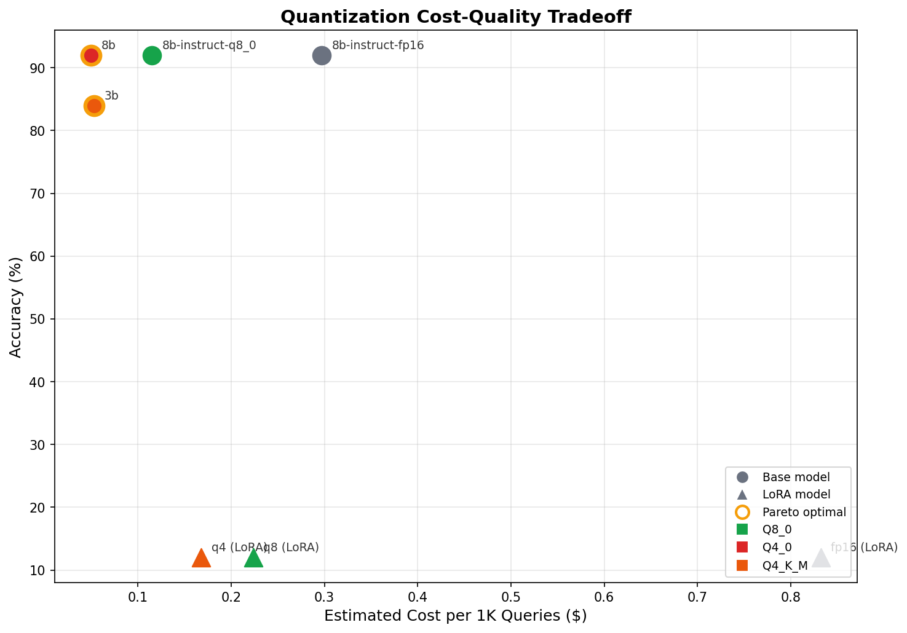
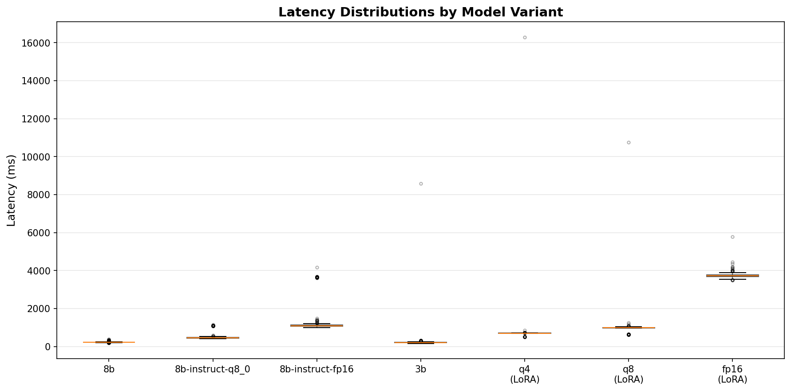
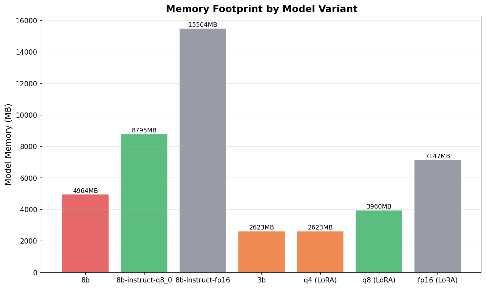
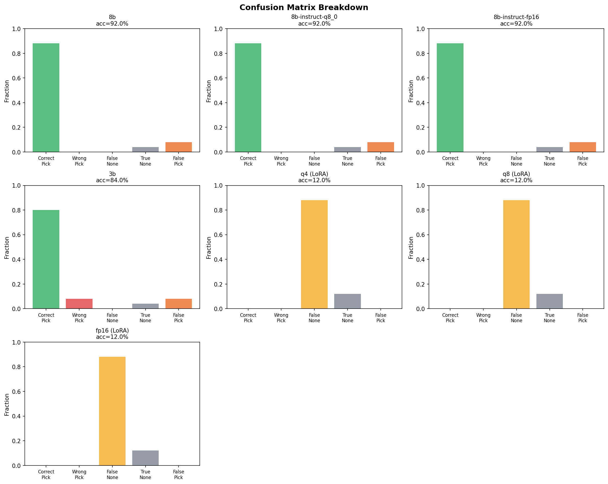

# KYB Quantization & LoRA Benchmark Report

## Comparison Table

| Variant | Quant | LoRA | Accuracy | P50 (ms) | P95 (ms) | Mem (MB) | Tok/s | $/1K | Pareto |
|---------|-------|------|----------|----------|----------|----------|-------|------|--------|
| llama3:8b | q4_0 |  | 92.0% | 218.5 | 293.5 | 4964 | 8.9 | $0.0498 | **Yes** |
| llama3:8b-instruct-q8_0 | q8_0 |  | 92.0% | 458.7 | 1086.8 | 8795 | 3.9 | $0.1149 |  |
| llama3:8b-instruct-fp16 | f16 |  | 92.0% | 1091.0 | 3644.6 | 15504 | 1.5 | $0.2970 |  |
| llama3.2:3b | q4_k_m |  | 84.0% | 197.2 | 288.7 | 2623 | 8.4 | $0.0531 | **Yes** |
| llama3-kyb-lora:q4 | q4_k_m | Yes | 12.0% | 697.4 | 716.4 | 2623 | 65.3 | $0.1678 |  |
| llama3-kyb-lora:q8 | q8_0 | Yes | 12.0% | 982.0 | 1030.6 | 3960 | 48.1 | $0.2237 |  |
| llama3-kyb-lora:fp16 | f16 | Yes | 12.0% | 3716.6 | 3968.2 | 7147 | 13.4 | $0.8319 |  |

## Per-Goal Metrics

| Variant | Goal | Precision | Recall | F1 |
|---------|------|-----------|--------|----|
| llama3:8b | careers | 0.929 | 1.000 | 0.963 |
| llama3:8b | contact | 0.900 | 1.000 | 0.947 |
| llama3:8b-instruct-q8_0 | careers | 0.929 | 1.000 | 0.963 |
| llama3:8b-instruct-q8_0 | contact | 0.900 | 1.000 | 0.947 |
| llama3:8b-instruct-fp16 | careers | 0.929 | 1.000 | 0.963 |
| llama3:8b-instruct-fp16 | contact | 0.900 | 1.000 | 0.947 |
| llama3.2:3b | careers | 0.857 | 1.000 | 0.923 |
| llama3.2:3b | contact | 0.800 | 1.000 | 0.889 |
| llama3-kyb-lora:q4 | careers | 0.000 | 0.000 | 0.000 |
| llama3-kyb-lora:q4 | contact | 0.000 | 0.000 | 0.000 |
| llama3-kyb-lora:q8 | careers | 0.000 | 0.000 | 0.000 |
| llama3-kyb-lora:q8 | contact | 0.000 | 0.000 | 0.000 |
| llama3-kyb-lora:fp16 | careers | 0.000 | 0.000 | 0.000 |
| llama3-kyb-lora:fp16 | contact | 0.000 | 0.000 | 0.000 |

## Confusion Matrix Summary

| Variant | Correct Pick | Wrong Pick | False None | True None | False Pick | None Rate |
|---------|-------------|------------|------------|-----------|------------|-----------|
| llama3:8b | 220 | 0 | 0 | 10 | 20 | 4.0% |
| llama3:8b-instruct-q8_0 | 220 | 0 | 0 | 10 | 20 | 4.0% |
| llama3:8b-instruct-fp16 | 220 | 0 | 0 | 10 | 20 | 4.0% |
| llama3.2:3b | 200 | 20 | 0 | 10 | 20 | 4.0% |
| llama3-kyb-lora:q4 | 0 | 0 | 220 | 30 | 0 | 100.0% |
| llama3-kyb-lora:q8 | 0 | 0 | 220 | 30 | 0 | 100.0% |
| llama3-kyb-lora:fp16 | 0 | 0 | 220 | 30 | 0 | 100.0% |

## Pareto-Optimal Configurations

These variants are not dominated by any other variant on accuracy, latency, and cost combined:

- **llama3:8b**: accuracy=92.0%, p50=218.5ms, mem=4964MB, cost=$0.0498/1K queries
- **llama3.2:3b**: accuracy=84.0%, p50=197.2ms, mem=2623MB, cost=$0.0531/1K queries

## Visualizations

